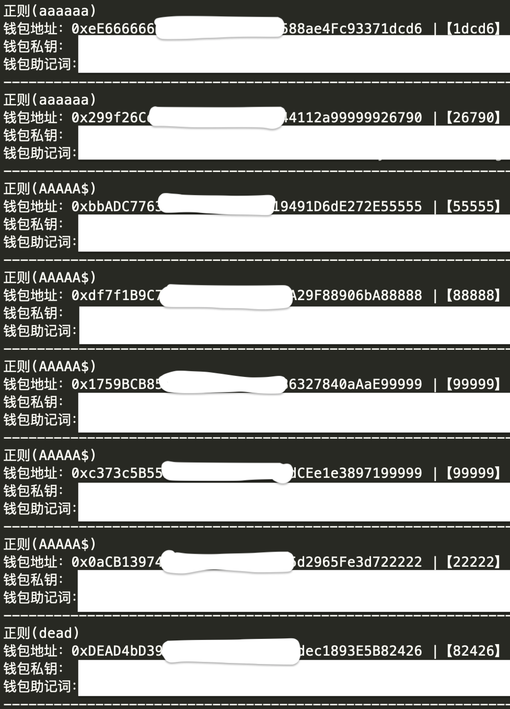

# ETHWalletAddressGood
离线生成以太坊钱包靓号地址(Generate an Ethereum wallet good account number offline)

## 使用步骤
1.homebrew 安装 node js

```bash
brew install node
```
2.npm安装ethers依赖库

```bash
npm install -save ethers
```
3.运行ETHGood.js

```bash
node ETHGood.js
```

## 效果图


